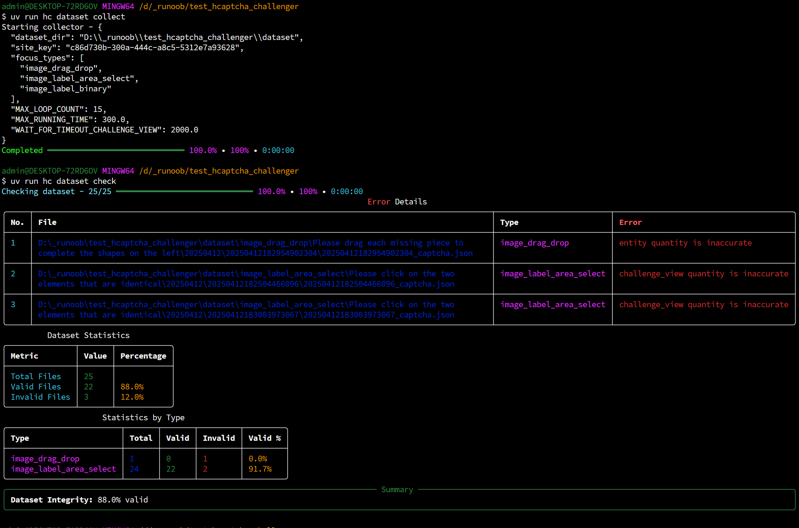

# Tài liệu

## Bắt đầu

### Giới thiệu

hCaptcha Challenger khai thác khả năng suy luận chuỗi tư duy không gian (SCoT) của các mô hình ngôn ngữ lớn đa phương thức (MLLM) để xây dựng một khung làm việc dựa trên tác nhân. Kiến trúc này cho phép các tác nhân tự động thực hiện khả năng thích ứng zero-shot trên các tác vụ không gian-trực quan đa dạng thông qua các quy trình giải quyết vấn đề động, loại bỏ yêu cầu tinh chỉnh cụ thể theo tác vụ hoặc các tham số đào tạo bổ sung.

`Agent` điều khiển các trang trình duyệt thông qua Playwright. Trong quy trình làm việc của bạn, Agent được khởi tạo với đối tượng `Page` mà bạn truyền vào, cho phép Agent tiếp quản các tương tác với trang hiện tại. Bạn có thể triển khai hai hoạt động độc lập thông qua `Agent`: `click_checkbox` và `wait_for_challenge`.

hCaptcha là một trong những người tiên phong trong việc áp dụng công nghệ khuếch tán và tổng hợp hình ảnh vào lĩnh vực CAPTCHA. Nhờ những tiến bộ nhanh chóng trong kỹ thuật tự động hóa, hCaptcha có thể triển khai các bản cập nhật cực kỳ thường xuyên cho các loại thử thách của mình. Trong hai năm qua, cộng đồng ngày càng gặp khó khăn trong việc xử lý những thách thức người-máy thay đổi thường xuyên như vậy. Các mạng nơ-ron tích chập (CNN) truyền thống gặp phải những khó khăn đáng kể trong việc đạt được khả năng tổng quát hóa tốt trên các tập dữ liệu nhỏ trong các tác vụ phát hiện đối tượng. Một quy trình tinh chỉnh toàn diện thường đòi hỏi thời gian và công sức đáng kể, thường mất đến nửa tuần để tạo ra một mô hình CNN phù hợp cho môi trường sản xuất. Tuy nhiên, vào thời điểm quá trình đào tạo hoàn tất, hCaptcha có thể đã cập nhật lên các loại thử thách mới, khiến mô hình được đào tạo gần đây nhanh chóng trở nên lỗi thời hoặc không hiệu quả.

Do đó, cộng đồng khẩn cấp cần một giải pháp trực quan mạnh mẽ, tổng quát có khả năng giải quyết hiệu quả các thách thức trực quan không gian khác nhau. Bất kể hCaptcha cập nhật các loại xác minh của mình thường xuyên như thế nào, **giải pháp này sẽ nhanh chóng thích ứng với những thay đổi của môi trường và tự động điều khiển trình duyệt để giải quyết các tác vụ CAPTCHA khác nhau mà không cần hướng dẫn của con người.**

### Cài đặt

```bash
uv pip install hcaptcha-challenger
```

### Bắt đầu nhanh

Tài liệu này mô tả một phương pháp tự động hóa để xử lý các thử thách hCaptcha, minh họa cách tương tác hiệu quả với các phần tử hCaptcha thông qua giao diện cánh tay robot của tác nhân.

Điều quan trọng cần nhấn mạnh là Agent tương tác độc quyền với các trang web thông qua đối tượng Page. Do đó, Agent có thể hoạt động liền mạch trên bất kỳ nền tảng hoặc "patcher" nào được xây dựng trên Playwright. Về mặt thực tế, điều này có nghĩa là bất kỳ trình duyệt nào được Playwright hỗ trợ và khởi chạy đều có thể được sử dụng để thực thi Agent bằng phương pháp này.

Trong ví dụ sau, bạn cần tạo và thiết lập [GEMINI_API_KEY](https://aistudio.google.com/apikey) của mình:

```python
import asyncio
import json

from playwright.async_api import async_playwright, Page

from hcaptcha_challenger.agent import AgentV, AgentConfig
from hcaptcha_challenger.models import CaptchaResponse
from hcaptcha_challenger.utils import SiteKey


async def challenge(page: Page) -> AgentV:
    """Automates the process of solving an hCaptcha challenge."""
    # Initialize the agent configuration with API key (from parameters or environment)
    agent_config = AgentConfig()

    # Create an agent instance with the page and configuration
    # AgentV appears to be a specialized agent for visual challenges
    agent = AgentV(page=page, agent_config=agent_config)

    # Click the hCaptcha checkbox to initiate the challenge
    # The robotic_arm is an abstraction for performing UI interactions
    await agent.robotic_arm.click_checkbox()

    # Wait for the challenge to appear and be ready for solving
    # This may involve waiting for images to load or instructions to appear
    await agent.wait_for_challenge()

    # Note: The code ends here, suggesting this is part of a larger solution
    # that would continue with challenge solving steps after this point
    return agent


async def main():
    async with async_playwright() as p:
        browser = await p.chromium.launch(headless=False)
        context = await browser.new_context()

        # Create a new page in the provided browser context
        page = await context.new_page()

        # Navigate to the hCaptcha test page using a predefined site key
        # SiteKey.user_easy likely refers to a test/demo hCaptcha with lower difficulty
        # await page.goto(SiteKey.as_site_link(SiteKey.discord))
        await page.goto(SiteKey.as_site_link(SiteKey.user_easy))

        # --- When you encounter hCaptcha in your workflow ---
        agent = await challenge(page)
        if agent.cr_list:
            cr: CaptchaResponse = agent.cr_list[-1]
            print(json.dumps(cr.model_dump(by_alias=True), indent=2, ensure_ascii=False))


if __name__ == "__main__":
    asyncio.run(main())

```

## Thu thập tập dữ liệu

Nếu bạn có trình giải quyết của riêng mình, bạn cũng có thể sử dụng `hcaptcha-challenger` để quản lý các tập dữ liệu hình ảnh:

```bash
uv venv
uv pip install -U hcaptcha-challenger
uv run hc dataset collect
```



## Thư viện ảnh


### Nhãn nhị phân hình ảnh

https://github.com/user-attachments/assets/c2cea4e0-82f4-466f-8c7a-20f8ea63732c

### Chọn vùng nhãn hình ảnh

https://github.com/user-attachments/assets/42ce8b1d-bb17-4397-b7b0-a9f9578b740a

### Kéo thả hình ảnh

https://github.com/user-attachments/assets/c7720d20-ddb4-45e5-8008-e4c8f2de316d